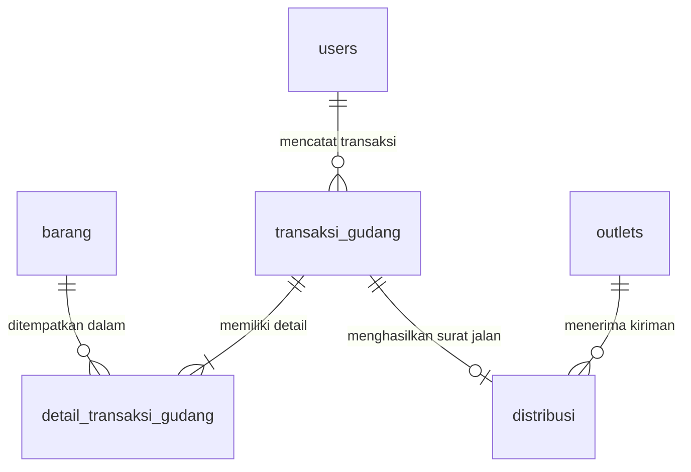

# DOKUMENTASI TEKNIS SISTEM INFORMASI (PROGRAMMER REPORT)
## SISTEM ADMINISTRASI GUDANG & DISTRIBUSI BARANG TERINTEGRASI
### PT GRAHA PRIMA MENTARI (LOGISTICS & DISTRIBUTORS CENTER)

---

## 1. PENDAHULUAN & ARSITEKTUR UMUM

Dokumen ini disusun sebagai panduan teknis bagi tim pengembang (*programmers*) untuk memahami struktur kode, arsitektur data, alur logika backend, serta desain antarmuka frontend dari proyek **Sistem Administrasi Gudang & Distribusi Terintegrasi PT Graha Prima Mentari**.

Sistem ini dirancang untuk menyelesaikan masalah operasional gudang seperti selisih stok (*stock discrepancy*), penundaan pengiriman barang oleh pengemudi (*lead-time delay*), serta miskalibrasi pembuatan laporan operasional. Aplikasi ini memisahkan hak akses secara ketat berdasarkan peran pengguna (*Role-Based Access Control*), mendistribusikan barang secara valid lewat verifikasi stok *real-time*, dan menyediakan cetak dokumen Surat Jalan dan Laporan Operasional berstandar industri.

### 1.1 Stack Teknologi yang Digunakan
Sistem ini menggunakan arsitektur modern berkinerja tinggi:

1. **Frontend (Client-Side):**
   - **HTML5:** Menggunakan elemen semantik terstruktur tinggi demi aksesibilitas dan SEO yang baik.
   - **Vanilla CSS3:** Custom Design System berbasis variabel warna HSL (*Harmonious Dark Glassmorphism*). Dilengkapi animasi mikro dan stylesheet cetak khusus (`@media print`).
   - **Vanilla JavaScript (ES6+):** Digunakan untuk mengelola state lokal, manipulasi DOM dinamis, manajemen sesi (*session storage*), interaksi API (*fetch API*), dan grafik dinamis.
   - **Chart.js:** Perpustakaan visualisasi data berbasis Canvas HTML5 untuk diagram komposisi kategori produk dan tren mutasi masuk vs keluar.

2. **Backend (Server-Side):**
   - **Node.js & Express.js:** Server REST API yang menangani otentikasi JWT, manipulasi data inventaris, verifikasi stok, dan penyusunan 8 jenis laporan transaksional.
   - **Prisma ORM:** *Object-Relational Mapping* tipe-aman (*type-safe*) untuk memetakan skema database relasional ke objek JavaScript.
   - **PostgreSQL (Supabase Hosted):** Database relasional untuk menyimpan tabel pengguna, barang, transaksi, logistik, dan data outlet secara terstruktur.

---

## 2. SKEMA DATABASE RELASIONAL (PRISMA SCHEMA)

Pemetaan database didefinisikan menggunakan berkas `backend/prisma/schema.prisma`. Seluruh relasi diatur secara ketat dengan aturan integritas referensial (seperti *Cascade Delete* pada detail transaksi).

### 2.1 Visualisasi Relasi Database (ERD Concept)


### 2.2 Rincian Model Skema Database

#### 2.2.1 Enum Global
1. **UserRole:**
   - `Admin_Gudang` (di-map ke `"Admin Gudang"`): Memiliki wewenang mutlak untuk menambah barang, melakukan inbound, memproses outbound (surat jalan), serta mendaftarkan driver/outlet baru.
   - `Pimpinan`: Memiliki akses baca penuh (*read-only*) untuk memantau dashboard, melacak pengiriman, dan mencetak 8 jenis laporan mutasi gudang.
   - `Pengantar_Barang` (di-map ke `"Pengantar Barang"`): Peran khusus pengemudi (driver). Hanya dapat melihat daftar kiriman miliknya dan mengubah status distribusi (`Persiapan` $\rightarrow$ `Pengiriman` $\rightarrow$ `Selesai`).

2. **StatusDistribusi:**
   - `Persiapan`: Barang telah diverifikasi dan dikemas di gudang. Surat Jalan digital telah diterbitkan.
   - `Pengiriman`: Driver sedang dalam perjalanan membawa produk menuju alamat outlet tujuan.
   - `Selesai`: Barang telah sampai di outlet tujuan dan dikonfirmasi diterima oleh penanggung jawab outlet (mencatat waktu otomatis).

#### 2.2.2 Tabel Pengguna (`users`)
Menyimpan kredensial sistem admin gudang, pimpinan, dan driver.
* **`id`** (`Int`): Kunci primer otomatis bertambah (*Auto Increment*).
* **`username`** (`String`): Unik, batas 50 karakter. Digunakan untuk proses login.
* **`password_hash`** (`String`): Hash sandi menggunakan enkripsi aman Bcrypt.
* **`password_plain`** (`String?`): Opsional, menyimpan sandi asli untuk kemudahan inspeksi admin gudang pada akun driver logistik.
* **`role`** (`UserRole`): Hak akses sistem.
* **`nama_lengkap`** (`String`): Nama lengkap personal.
* **`created_at`** (`DateTime`): Waktu registrasi akun.

#### 2.2.3 Tabel Master Barang (`barang`)
Menyimpan data katalog produk distributor.
* **`id`** (`Int`): Kunci primer.
* **`kode_barang`** (`String`): SKU unik (Stock Keeping Unit), misalnya `SKU-001`.
* **`nama_barang`** (`String`): Nama produk, batas 150 karakter.
* **`kategori`** (`String`): Kategori klasifikasi produk (misal: "Minuman Bersoda", "Air Mineral").
* **`stok_minimum`** (`Int`): Ambang batas stok kritis (default: 10 unit).
* **`stok_sekarang`** (`Int`): Jumlah unit fisik aktual saat ini di dalam gudang.
* **`harga`** (`Decimal`): Nilai jual produk per unit (presisi desimal tinggi: `12, 2`).

#### 2.2.4 Tabel Transaksi Gudang (`transaksi_gudang`)
Mencatat seluruh log aktivitas masuk (Inbound) dan keluar (Outbound).
* **`id`** (`Int`): Kunci primer.
* **`nomor_transaksi`** (`String`): Nomor referensi transaksi unik (misal: `TX-IN-20260520-111759`).
* **`jenis_transaksi`** (`String`): Kode tipe transaksi: `'IN'` (masuk) atau `'OUT'` (keluar).
* **`tanggal_transaksi`** (`DateTime`): Tanggal dan waktu transaksi dilakukan.
* **`admin_id`** (`Int`): Relasi kunci asing ke tabel `User` (siapa admin yang memprosesnya).
* **`keterangan`** (`String?`): Catatan tambahan mengenai transaksi.

#### 2.2.5 Tabel Detail Transaksi Gudang (`detail_transaksi_gudang`)
Tabel jembatan untuk menyimpan daftar item dalam satu transaksi (karena satu transaksi dapat berisi banyak barang).
* **`id`** (`Int`): Kunci primer.
* **`transaksi_id`** (`Int`): Relasi kunci asing ke `TransaksiGudang` (dihapus otomatis lewat *Cascade* jika transaksi induk dihapus).
* **`barang_id`** (`Int`): Kunci asing relasi ke katalog `Barang`.
* **`jumlah`** (`Int`): Kuantitas unit produk yang dimutasi dalam transaksi tersebut.

#### 2.2.6 Tabel Pengiriman Logistik (`distribusi`)
Mencatat riwayat pengiriman logistik berdasarkan transaksi OUT yang sah, lengkap dengan data kurir/driver.
* **`id`** (`Int`): Kunci primer.
* **`surat_jalan`** (`String`): Nomor dokumen Surat Jalan unik (misal: `SJ-20260520-1014`).
* **`transaksi_id`** (`Int`): Kunci asing relasi ke transaksi `OUT` induk.
* **`outlet_tujuan`** (`String`): Nama outlet atau toko yang dituju.
* **`nama_driver`** (`String`): Nama driver logistik yang bertugas mengirimkan barang.
* **`status_pengiriman`** (`StatusDistribusi`): Tahapan kurir logistik (`Persiapan`, `Pengiriman`, `Selesai`).
* **`tanggal_kirim`** (`DateTime`): Tanggal dan waktu barang mulai meninggalkan gudang.
* **`tanggal_diterima`** (`DateTime?`): Waktu tepat saat driver mengubah status kiriman menjadi `Selesai`.

#### 2.2.7 Tabel Master Outlet (`outlets`)
Menyimpan database alamat pengiriman retail / outlet rekanan logistik.
* **`id`** (`Int`): Kunci primer.
* **`nama_outlet`** (`String`): Nama outlet unik.
* **`alamat`** (`String?`): Alamat fisik lengkap outlet tujuan.
* **`telepon`** (`String?`): Nomor kontak operasional outlet.

---

## 3. LOGIKA BACKEND & ROUTING API (`server.js`)

Berkas `backend/server.js` adalah otak operasional server API. Backend ini dibangun menggunakan Express.js dengan middleware otentikasi JWT yang memproteksi rute sensitif dari akses ilegal.

### 3.1 Middleware Pengamanan Peran (*Role-Based Security*)

Backend menerapkan 4 middleware khusus untuk menyaring token JWT dan memvalidasi tipe peran pengguna:

1. **`authenticateToken`:**
   Membaca *header* request `Authorization: Bearer <TOKEN>`. Jika tidak ada token atau token kadaluwarsa, server segera menghentikan request dengan status `401 (Unauthorized)` atau `403 (Forbidden)`. Jika token valid, mendekode muatan (*payload*) pengguna ke variabel request `req.user`.

2. **`isAdminGudang`:**
   Memeriksa apakah `req.user.role === 'Admin Gudang'`. Rute mutasi data (seperti `POST /api/barang` atau `POST /api/transaksi`) diproteksi penuh oleh middleware ini.

3. **`isAuthorizedForReports`:**
   Membatasi cetak data operasional. Hanya `Admin Gudang` dan `Pimpinan` yang diizinkan memanggil API penyusunan laporan transaksional.

4. **`canUpdateDistStatus`:**
   Mengizinkan `Admin Gudang` dan `Pengantar Barang` (driver) untuk memperbarui tahapan distribusi logistik. Pimpinan dilarang keras mengubah status operasional.

### 3.2 Manajemen Transaksi Database Atomik (`$transaction`)

Untuk menjamin konsistensi jumlah stok gudang agar tidak terjadi selisih akibat *race condition* (misalnya dua transaksi keluar diproses bersamaan saat stok menipis), pemrosesan transaksi mutasi di backend diwajibkan menggunakan fitur **Atomic Transaction** dari Prisma (`prisma.$transaction`).

Contoh implementasi atomik pada pemrosesan transaksi mutasi gudang (`POST /api/transaksi`):
```javascript
const result = await prisma.$transaction(async (tx) => {
    // 1. Buat data transaksi induk
    const txGudang = await tx.transaksiGudang.create({
        data: { nomor_transaksi, jenis_transaksi, admin_id, keterangan }
    });

    // 2. Iterasi barang, periksa stok fisik, lalu perbarui stok secara aman
    for (const item of detail_items) {
        const dbBarang = await tx.barang.findUnique({
            where: { id: parseInt(item.barang_id) }
        });

        if (!dbBarang) throw new Error("Barang tidak ditemukan");

        let newStock = dbBarang.stok_sekarang;
        if (jenis_transaksi === 'IN') {
            newStock += item.jumlah;
        } else if (jenis_transaksi === 'OUT') {
            if (dbBarang.stok_sekarang < item.jumlah) {
                // Gagalkan seluruh transaksi otomatis jika stok gudang tidak cukup!
                throw new Error(`Stok ${dbBarang.nama_barang} tidak mencukupi!`);
            }
            newStock -= item.jumlah;
        }

        // Simpan nilai stok baru ke database
        await tx.barang.update({
            where: { id: dbBarang.id },
            data: { stok_sekarang: newStock }
        });

        // Rekam baris detail transaksi
        await tx.detailTransaksiGudang.create({
            data: {
                transaksi_id: txGudang.id,
                barang_id: dbBarang.id,
                jumlah: item.jumlah
            }
        });
    }
    return txGudang;
});
```

---

## 4. PENJELASAN 8 ENDPOINT LAPORAN OPERASIONAL

Pimpinan gudang membutuhkan data real-time untuk analisis logistik. Backend menyediakan 8 API Laporan terintegrasi dengan filter pencarian rentang tanggal transaksi yang akurat:

1. **Laporan Transaksi Barang Masuk (Inbound) (`GET /api/reports/inbound`):**
   - **Logika:** Melakukan filter `DetailTransaksiGudang` yang memiliki `transaksi.jenis_transaksi === 'IN'`.
   - **Data output:** Tanggal masuk, nomor referensi inbound, kode barang, nama produk, kuantitas masuk, dan nama admin yang bertugas.

2. **Laporan Transaksi Barang Keluar (Outbound) (`GET /api/reports/outbound`):**
   - **Logika:** Mengambil baris detail transaksi yang memiliki jenis mutasi `'OUT'`.
   - **Data output:** Tanggal pengiriman, nomor transaksi, nama barang, total qty keluar, dan nama admin gudang yang memproses.

3. **Laporan Mutasi Stok (Kartu Stok) (`GET /api/reports/mutasi-stok`):**
   - **Logika:** Menggabungkan log transaksi IN dan OUT dalam satu urutan waktu historis.
   - **Data output:** Tanggal kejadian, tipe mutasi (IN/OUT), nomor referensi, nama barang, kuantitas masuk, dan kuantitas keluar.

4. **Laporan Rekapitulasi Status Distribusi (`GET /api/reports/rekap-distribusi`):**
   - **Logika:** Mengambil seluruh data di tabel `Distribusi`, merinci tahapan pengiriman dari Persiapan hingga Selesai.
   - **Data output:** Nomor Surat Jalan, Outlet tujuan, nama driver, tanggal kirim, tanggal selesai/diterima, serta status aktual kurir.

5. **Laporan Performa Waktu Pengiriman (Lead-Time) (`GET /api/reports/lead-time`):**
   - **Logika:** Mengambil kiriman logistik berkode status `Selesai`, lalu menghitung durasi selisih waktu antara `tanggal_diterima` dan `tanggal_kirim` dalam satuan Jam menggunakan fungsi tanggal PostgreSQL.
   - **Data output:** Nomor Surat Jalan, nama Driver, nama Outlet tujuan, waktu keberangkatan, waktu sampai, dan selisih durasi perjalanan (dalam Jam).

6. **Laporan Analisis Barang Distribusi Cepat (Fast-Moving) (`GET /api/reports/fast-moving`):**
   - **Logika:** Mengelompokkan tabel `DetailTransaksiGudang` yang berjenis `'OUT'`, menjumlahkan kuantitas unit terjual/keluar berdasarkan barang, lalu mengurutkannya secara menurun (*descending*).
   - **Data output:** Peringkat terlaris, kode barang, nama produk, kategori, stok saat ini di gudang, dan akumulasi volume keluar.

7. **Laporan Serapan Distribusi Berdasarkan Outlet (`GET /api/reports/outlet-serapan`):**
   - **Logika:** Menghitung total akumulasi pengiriman sukses dan total volume unit barang yang berhasil dikirimkan ke masing-masing outlet.
   - **Data output:** Nama Outlet tujuan, total frekuensi kiriman sukses, total volume unit produk terkirim, dan alamat outlet.

8. **Laporan Produktivitas Log Transaksi Admin Gudang (`GET /api/reports/admin-productivity`):**
   - **Logika:** Menghitung jumlah kontribusi frekuensi pencatatan transaksi masuk (IN) dan keluar (OUT) yang diproses oleh masing-masing personil akun Admin Gudang.
   - **Data output:** Nama lengkap Admin, total transaksi IN, total transaksi OUT, dan total gabungan transaksi gudang yang ditangani.

---

## 5. LOGIKA FRONTEND & TAMPILAN INTERAKTIF

Operasional frontend dikendalikan secara dinamis melalui berkas `app.js` yang terhubung dengan visualisasi `index.html` dan tata letak `styles.css`.

### 5.1 Alur Sistem Single Page Application (SPA)
Perpindahan menu navigasi diatur tanpa memuat ulang browser (*SPA routing*) melalui fungsi `switchPanel(panelId)`. Fungsi ini:
- Menghapus kelas `.active` dari menu lama dan menyematkannya ke menu baru di sidebar.
- Menghapus kelas `.hidden` dari panel yang dituju dan menyematkannya ke panel kontainer lainnya.
- Memperbarui teks judul header utama (`current-panel-title`).
- Memanggil fungsi pengisian data real-time, seperti `renderLaporanPanel()` atau `renderDashboardPanel()`.

### 5.2 Validasi Ketersediaan Stok Real-Time
Untuk menghindari kesalahan manusia (*human error*) berupa pembuatan surat jalan distribusi yang melebihi jumlah unit fisik barang di gudang, sistem menyediakan fitur **Live Stok Validation** sebelum barang dapat dimasukkan ke daftar distribusi:

```javascript
document.getElementById('btn-cek-stok').addEventListener('click', async () => {
    const barangId = parseInt(document.getElementById('select-validasi-barang').value);
    const qty = parseInt(document.getElementById('input-validasi-qty').value);
    const feedback = document.getElementById('feedback-validasi-stok');
    const btnTambah = document.getElementById('btn-tambah-checklist');

    const barangDb = await apiFetch('/barang');
    const item = barangDb.find(b => b.id === barangId);

    // Cari tahu apakah barang ini sudah ada di daftar sementara (temp list)
    const alreadyInList = tempOutboundChecklist.find(c => c.barang_id === barangId);
    const addedQty = alreadyInList ? alreadyInList.jumlah : 0;
    const totalNeeded = qty + addedQty;

    if (item.stok_sekarang >= totalNeeded) {
        // Stok mencukupi, tombol tambah diaktifkan!
        feedback.innerText = "Stok Tersedia!";
        btnTambah.disabled = false;
    } else {
        // Stok kurang, tombol tambah tetap dikunci!
        feedback.innerText = "Stok Tidak Cukup!";
        btnTambah.disabled = true;
    }
});
```

### 5.3 Integrasi Visualisasi Chart.js
Ketika panel Dashboard dibuka, fungsi `renderCharts` akan menginisialisasi dua grafik interaktif:
1. **Diagram Lingkaran (Doughnut Chart):** Membaca properti kategori produk dan menyajikan persentase kepemilikan unit produk di gudang secara visual.
2. **Diagram Batang (Bar Chart):** Mengakumulasikan kuantitas kumulatif volume mutasi barang masuk (IN) vs barang keluar (OUT) dari seluruh log riwayat transaksi gudang.

---

## 6. ANALISIS PENYEBAB & SOLUSI BUG CETAK LAYOUT

Sebelumnya, terdapat kendala (*bug*) tata letak yang mengganggu ketika pimpinan gudang mencoba mengekspor laporan menjadi dokumen cetak atau mengganti orientasi kertas dari Portrait ke Landscape. Berikut adalah catatan teknis mengenai penyelesaian bug tersebut:

### 6.1 Penyebab Masalah Tampilan
1. **Kebocoran Desain Responsif Seluler ke Mesin Cetak:**
   Aturan media query responsif layar seluler seperti `@media (max-width: 1024px)` sebelumnya ditulis tanpa mendefinisikan media target secara spesifik. Saat melakukan *print preview*, lebar kertas A4 (yaitu **~794px** dalam posisi Portrait) dibaca oleh peramban sebagai layar berukuran kecil. Akibatnya, aturan desain responsif layar seluler ikut aktif dalam mode cetak, sehingga elemen yang harusnya disembunyikan (seperti form filter, tombol reset, dan navigasi topbar) dipaksa tampil oleh instruksi `display: flex !important` milik UI seluler.
2. **Kekacauan Flexbox & Scrollbar di Mode Landscape:**
   Ketika orientasi cetak diubah ke posisi mendatar (Landscape), lebar bidang cetak melebar menjadi **~1082px**. Mesin cetak peramban (*print engine*) tidak dapat menghitung ulang sumbu arah layout flexbox (`display: flex`) dari kontainer utama `.app-container` secara dinamis pada media cetak, sehingga tabel terpotong. Selain itu, properti `.table-wrapper { overflow-x: auto }` yang digunakan untuk scrollbar seluler memicu munculnya batas potong (*clipping*) pada kertas landscape.

### 6.2 Implementasi Kode Solusi (Telah Diterapkan di `styles.css`)

1. **Mengisolasi Media Query khusus untuk Media Layar (`screen`):**
   Seluruh deklarasi media query responsif layar kini diubah untuk secara ketat hanya menyasar perangkat layar monitor dengan prefix `screen and`, sehingga mesin cetak (*print engine*) akan sepenuhnya mengabaikannya:
   ```css
   /* SEBELUMNYA */
   @media (max-width: 1024px) { ... }

   /* SOLUSI KINI */
   @media screen and (max-width: 1024px) { ... }
   ```

2. **Memaksa Kontainer Utama Menjadi Aliran Blok Standard (`display: block`):**
   Pada saat dokumen dicetak (`@media print`), kontainer utama dinonaktifkan dari model flexbox dan diubah menjadi aliran blok standard untuk stabilitas pagination:
   ```css
   @media print {
       .app-container {
           display: block !important;
           width: 100% !important;
           min-height: 0 !important;
           height: auto !important;
       }
   }
   ```

3. **Memaksa Batas Potong Scrollbar Menjadi Tampak (`overflow: visible`):**
   Menghapus kendala pemotongan kolom tabel saat orientasi kertas dilebarkan ke posisi landscape:
   ```css
   @media print {
       .table-wrapper {
           overflow: visible !important;
           width: 100% !important;
       }
   }
   ```

4. **Sembunyikan Petunjuk Geser Tabel:**
   Mereduksi teks visual yang tidak penting seperti petunjuk scroll horizontal seluler (`.table-scroll-hint`) dari kertas cetak laporan.

---

## 7. PANDUAN EKSPOR DOKUMEN INI KE PDF / MS WORD

Agar berkas dokumentasi teknis ini dapat diserahkan dalam bentuk PDF premium atau berkas Word (.docx), Anda dapat mengikuti salah satu dari langkah mudah berikut:

### Opsi A: Ekspor Langsung ke PDF via VS Code (Sangat Direkomendasikan)
1. Pasang ekstensi **Markdown PDF** (*oleh yzane*) di VS Code Anda.
2. Buka berkas `DOKUMENTASI_TEKNIS.md` ini di editor VS Code.
3. Klik kanan di area mana saja pada teks editor, lalu pilih menu **Markdown PDF: Export (pdf)**.
4. Berkas PDF berformat profesional lengkap dengan pewarnaan kode akan langsung tercipta di direktori proyek Anda.

### Opsi B: Konversi via Browser Web (Mudah & Cepat)
1. Buka berkas `.md` ini di situs pembaca markdown online gratis (seperti [StackEdit](https://stackedit.io) atau [Dillinger](https://dillinger.io)).
2. Pilih menu **Export / Print** di peramban Anda.
3. Atur tujuan printer menjadi **Save as PDF** / **Microsoft Print to PDF**.
4. Simpan hasil cetak ke penyimpanan komputer Anda.

### Opsi C: Ubah Menjadi Berkas Microsoft Word (.docx)
1. Buka berkas `DOKUMENTASI_TEKNIS.md` ini menggunakan aplikasi pengolah teks sederhana.
2. Salin seluruh konten teks di dalamnya (`Ctrl + A`, lalu `Ctrl + C`).
3. Buka dokumen kosong baru di aplikasi **Microsoft Word** atau **Google Docs**.
4. Tempel teks tersebut (`Ctrl + V`). Aplikasi Word akan secara otomatis mengenali sintaks markdown dan mengubahnya menjadi format tulisan judul, daftar poin, tebal/miring, tabel, dan blok kode pemrograman secara rapi dan presisi! Anda tinggal menyimpannya sebagai berkas `.docx` atau mengekspornya menjadi PDF melalui menu *Save As*.
